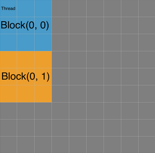

This example will walkthroigh the steps needed in order to execute code on a Nvidia GPU using the CUDA api from within R.

Below is the function that will be used as an example of using CUDA.In reality this function would be executed with a loop.

```{code=R eval=FALSE}
fn1 <- function(a, b, t) {
  N <- length(t)
  nv <- length(a)
  stopifnot(length(a)==length(b))
  TMP <- vector(mode='numeric', N)
  tmp <- vector(mode='numeric', nv)
  for (j in 1:N) {
    for (k in 1:nv)
      tmp[[k]] <- exp(a[[k]] + b[[k]]*t[[j]])
    TMP[[j]] <- log(sum(tmp))
  }
  sum(TMP)
}
```

###Using CUDA
We found that each iteration of the outer loop in function could be run independantly as each iteration's result did not depend on a previous iteration. Therefore each iteration could be run on a CUDA kernel.
Firstly some set up needs to be done, such as copying the data onto the CUDA device. The below is defined in the Kernels.cu file and declared in the Kernels.h file.

```{code=C++ eval=FALSE}
double* CUDALogLikelihood(double* data, unsigned int data_length, double** a, double** b, unsigned int vector_length, unsigned int iterations)
{   
    double* d_data; //device pointer for data
    unsigned int size_of_data = sizeof(double) * data_length;
    cudaMalloc(&d_data, size_of_data);  //make space in GPU memory for data
    cudaMemcpy(d_data, data, size_of_data, cudaMemcpyHostToDevice); //copy data in a to GPU memory
    
    double* d_a; //device pointers for a and b
    double* d_b;
    unsigned int size_of_args = sizeof(double) * vector_length;
    cudaMalloc(&d_a, size_of_args);  //make space in GPU memory for args
    cudaMalloc(&d_b, size_of_args);  //make space in GPU memory for args

    double* tmp = new double[data_length];
    double* d_tmp;
    cudaMalloc(&d_tmp, sizeof(double) * data_length);  //make space in GPU memory for result
    
    dim3 threadsPerBlock(32);
    
    int round_up = ( data_length + 32 - 1 ) / 32;
    
    dim3 blocksPerGrid( round_up );

    double* result = new double[iterations];
    std::fill(result, result+iterations, 0);
    
    for (unsigned int i = 0; i < iterations; i++) {
        
        double* a_temp = a[i];
        double* b_temp = b[i];
        
        cudaMemcpy(d_a, a_temp, size_of_args, cudaMemcpyHostToDevice); //copy 'a' to GPU memory
        cudaMemcpy(d_b, b_temp, size_of_args, cudaMemcpyHostToDevice); //copy 'b' to GPU memory

        logLikelihood<<<blocksPerGrid, threadsPerBlock>>>(d_a, d_b, d_data, vector_length, data_length, d_tmp);
        
        cudaMemcpy(tmp, d_tmp, sizeof(double) * data_length, cudaMemcpyDeviceToHost);

        for (unsigned int j = 0; j < data_length; j++) {
            result[i] += tmp[j];
        }
    }
    
    cudaFree(d_a);
    cudaFree(d_b);
    cudaFree(d_data);
    cudaFree(d_tmp);
    
    cudaDeviceReset();
    
    return result;
}
}
```
This performs the same operation as the previously defined function in R, with the change that if the values of the vectors a and b could be known in advance then multiple iterations of the function could be run. This is controled by the 'iterations' parameter and can be set to 1 if only a single iteration is needed.
Each kernel is launched using a launch configuration that looks like:

> kernel<<\<blocksPerGrid, threadsPerBlock\>>>(args...);

The launch configuration tell CUDA how many blocks and how many threads to use when
executing a kernel. A block is just a logical group of threads but generally the number of
threads per block should be a multiple of the warp size. A grid is a logical collection of blocks.
The two arguments passed to the launch configuration can also have multiple dimensions to
make data access easier and to allow more blocks to execute on the grid.In the diagram
below, the launch configuration has 3x3 blocks in the grid and 3x3 threads per block.



Next the code that needs to be executed on each Kernel needs to be written. 

```{code=C++ eval=FALSE}
__global__ void logLikelihood(double* a, double* b, double* data, unsigned int vector_length, unsigned int data_length, double* result)
{
    int i = blockDim.x * blockIdx.x + threadIdx.x;
    
    double sum = 0;
    for (unsigned int j = 0; j < vector_length; j++) {
        sum += exp(a[j] + b[j]*data[i]);
    }
    result[i] = log(sum);
}

```
This performs the operation of a single instance of the outer loop. Each core uses its ID as an index for the results vector which holds the intermediate results of
each execution. This code performs the same operations a single iteration of the outer loop in
our example function. The ID is calculated based on the launch configuration of the kernel.

###Wrap using Rcpp
A wrapper function needs to be written using the Rcpp library, similiar to below which is defined in the rcuda.cpp file.

```{code=C++ eval=FALSE}
RcppExport SEXP cudaLog(SEXP a1, SEXP b1, SEXP t1, SEXP numIter)
{
  // Convert parameters from SEXP objects
  int iterations = Rcpp::as<int>(numIter);
  Rcpp::List a(a1);
  Rcpp::List b(b1);
  Rcpp::NumericVector data(t1);
  
  // Length of a vector from a or b (Should be the same)
  int len = as<std::vector<double> >(a[0]).size();
  
  // Convert a and b from a list of vectors to a 2d double array
  double ** cA = listTo2dDouble(a);
  double ** cB = listTo2dDouble(b);

  // Call the CUDA implementation of the log-likelihood function from Kernels.h with signature:
  double* res = CUDALogLikelihood(data.begin(), data.size(), cA, cB, len, iterations);
  
  // Convert the resultant double array to a double vector
  std::vector<double> result(res, res + iterations);
  
  // Wrap the resultant vector to a R object and return it
  return Rcpp::wrap(result);
}
```

This will be exported and callable from within R. As our function required 2d arrays of doubles the following conversion method was implemented:

```{code=C++ eval=FALSE}
double** listTo2dDouble(Rcpp::List list)
{
  // Get length of list and allocate size of result array
  int length = list.size();
  double ** temp = new double*[length];
  
  for(int i=0; i<length; i++) {
    // Retrieve the vector at position i from the list
    std::vector<double> test = as<std::vector<double> >(list[i]);
    
	// Allocate space for the result array
	int size = test.size();
    temp[i] = new double[size];
	
	// Copy elements from vector to a double array
    for(int j=0; j<size; j++)
    {
      temp[i][j] = test[j];
    }
  }
  
  // Return the 2d double array 
  return temp;
}
```

###Makefile
The following Makefile takes the code above and creates a shared library object (rcuda.so) that can then be imported and used within R.

```
R_HOME := $(shell R RHOME)
R_INC := /usr/share/R/include
R_LIB := $(R_HOME)/lib

CUDA_HOME := /usr/local/cuda-6.5
CUDA_INC := $(CUDA_HOME)/include
CUDA_LIB := $(CUDA_HOME)/lib64

RCPP_HOME := ../R/x86_64-pc-linux-gnu-library/3.0/Rcpp
RCPP_INC := $(RCPP_HOME)/include

CPICFLAGS := $(shell R CMD config CPICFLAGS)

OBJS := rcuda.o Kernels.o

INCS := -I. -I"$(CUDA_INC)" -I"$(R_INC)" -I"$(RCPP_INC)"
PARAMS := -Xcompiler $(CPICFLAGS)

LD_PARAMS := -Xlinker -rpath,$(CUDA_LIB)
LIBS :=  -L$(R_LIB) -L$(CUDA_LIB) -lcublas -lcudart $(shell R CMD config BLAS_LIBS)

TARGETS := rcuda.so

NVCC := /usr/local/cuda-6.5/bin/nvcc

all: $(TARGETS) 

$(TARGETS): $(OBJS)
	$(NVCC) -shared $(LD_PARAMS) $(LIBS) $(OBJS) -o $@

Kernels.o: Kernels.cu
	$(NVCC) -c $(INCS) $(PARAMS) $^ -o $@

rcuda.o: rcuda.cpp
	$(NVCC) -c $(INCS) $(PARAMS) $^ -o $@

clean:
	rm -rf *o

.PHONY: all clean
```

###Importing into R
Finally the shared library can be imported and used as follows:

```{code=R eval=FALSE}
library(Rcpp)
dyn.load("rcuda.so")

# Wrapper function to call the CUDA implementation of
# the log-likelihood function
cudaLog <- function(a, b, t, iterations) 
{
  .Call("cudaLog", a, b, t, iterations)
}
```

Now the 'cudaLog' function can be called like any normal R function.

###Resources
* [http://cran.rproject.org/web/packages/Rcpp/index.html](http://cran.rproject.org/web/packages/Rcpp/index.html)
* [http://www.slideshare.net/romainfrancois/integratingrwithcrcpprinsideandrprotobuf](http://www.slideshare.net/romainfrancois/integratingrwithcrcpprinsideandrprotobuf)
* [http://cran.rproject.org/doc/manuals/rrelease/Rints.html#SEXPs](http://cran.rproject.org/doc/manuals/rrelease/Rints.html#SEXPs)
* [http://www.biosino.org/R/Rdoc/Rints/SEXPs.html](http://www.biosino.org/R/Rdoc/Rints/SEXPs.html)
* [https://github.com/nullsatz/matmult](https://github.com/nullsatz/matmult)
* [http://www.rbloggers.com/parallelprogrammingwithgpusandr/](http://www.rbloggers.com/parallelprogrammingwithgpusandr/)
* [http://dirk.eddelbuettel.com/papers/rcpp_workshop_advanced_user2012.pdf](http://dirk.eddelbuettel.com/papers/rcpp_workshop_advanced_user2012.pdf)
* [http://moss.csc.ncsu.edu/~mueller/cluster/nvidia/2.0/nvcc_2.0.pdf](http://moss.csc.ncsu.edu/~mueller/cluster/nvidia/2.0/nvcc_2.0.pdf)